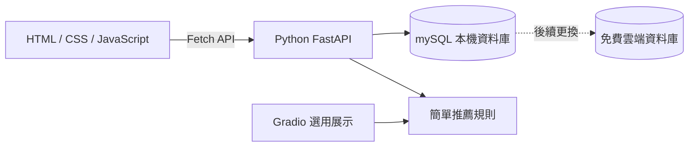
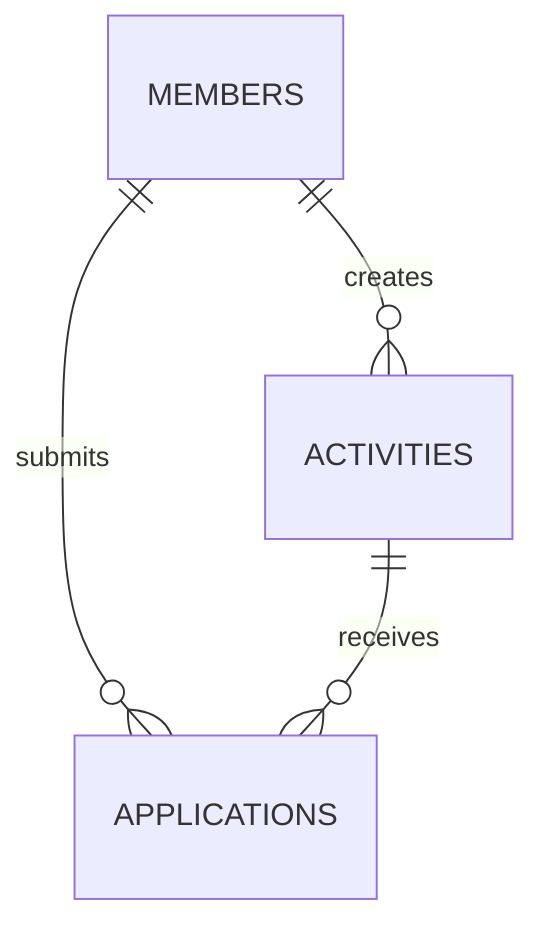
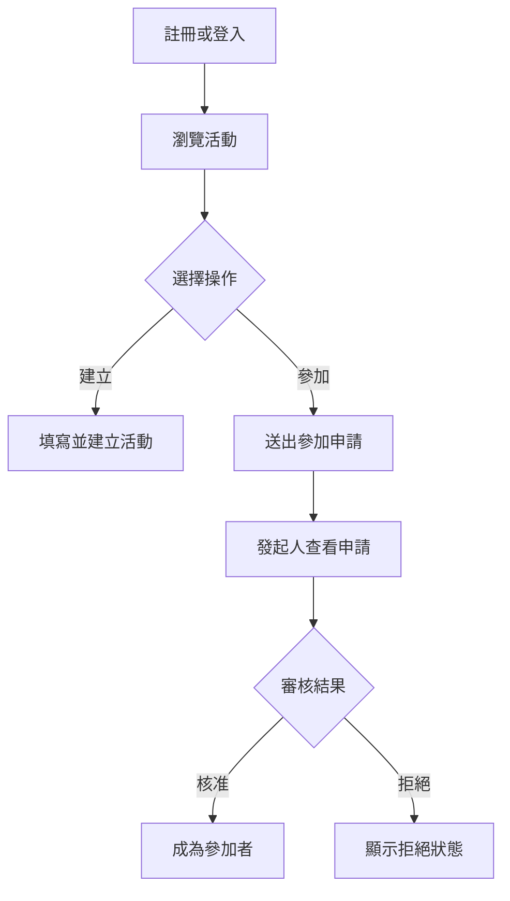

# Jiu-Eat WebApp 系統

## 1. 專案簡介

**Jiu-Eat** 是一個「揪人一起吃飯或參加活動」的 WebApp。

使用者可以註冊會員、登入、建立活動、瀏覽活動、申請參加活動；活動發起人可以核准或拒絕申請。系統也會依會員興趣、活動分類及地區，推薦可能適合的活動。

本專案開發內容以目前已學過的 HTML、CSS、JavaScript、Python 與 Gradio 為主。第一階段先在本機完成，之後再將資料庫換成免費雲端服務。

---

## 2. 專案目標

1. 完成一個可操作的會員活動平台。
2. 練習使用 HTML、CSS、JavaScript 製作網頁。
3. 練習 JavaScript 使用 Fetch 呼叫後端 API。
4. 練習使用 Python 處理會員、活動與申請資料。
5. 練習資料庫的新增、查詢、修改與刪除（CRUD）。
6. 活動推薦，使用機器學習。
7. 先完成本機版本，再保留改用免費雲端資料庫的空間。

---

## 3. 開發範圍

### 3.1 第一階段 MVP（必做）

- 會員註冊
- 會員登入、登出
- 查看與修改個人資料
- 查看活動列表及活動詳情
- 建立、修改、刪除自己建立的活動
- 申請參加活動
- 取消自己的申請
- 發起人查看申請名單
- 發起人核准或拒絕申請
- 查看自己建立及參加的活動
- 使用興趣、分類及地區進行簡單活動推薦

### 3.2 第二階段（時間足夠再做）

- 收藏活動
- 通知中心
- 候補名單
- 圖片上傳
- 管理員後台
- 地圖功能
- Email 或即時通知
- 會員互相配對

> 第一階段不製作金流、聊天、WebSocket、複雜推薦及完整社群功能。

---

## 4. 使用技術

| 項目            | 第一階段使用技術           | 說明                                         |
| --------------- | -------------------------- | -------------------------------------------- |
| 網站前端        | HTML、CSS、原生 JavaScript | 延續目前已完成的 `index.html`                |
| 後端            | Python + FastAPI           | 提供前端可呼叫的 API；可沿用現有 `main.py`   |
| Python 展示介面 | Gradio（選用）             | 可用來展示推薦結果或測試資料，不取代主要網站 |
| 本機資料庫      | mySQL                      | 不需安裝資料庫伺服器，適合作業開發           |
| 雲端資料庫      | PostgreSQL 或其他免費      | 第二階段再更換，連線資料使用環境變數         |
| 前後端串接      | JavaScript Fast API + JSON | HTML 網頁呼叫 Python API                     |
| 版本管理        | Git / GitHub（選用）       | 方便兩位組員整合程式                         |

### 4.1 為什麼 Gradio 不作為主要網站前端

Gradio 適合快速建立 Python Demo，但目前已經有 HTML 首頁，而且作業要練習 HTML、CSS 與 JavaScript。因此：

- Jiu-Eat 正式頁面使用 HTML、CSS、JavaScript。
- FastAPI 負責接收請求、操作資料庫並回傳 JSON。
- Gradio 只用於推薦功能展示或後台測試；若時間不足可以不做。

---

## 5. 系統架構



### 5.1 資料流

1. 使用者在 HTML 頁面操作。
2. JavaScript 使用 `fetch()` 呼叫 FastAPI。
3. FastAPI 驗證資料並讀寫 SQLite。
4. 後端以 JSON 回傳結果。
5. JavaScript 將結果顯示在網頁上。

---

## 6. 使用者角色

### 6.1 訪客

- 查看首頁、活動列表及活動詳情
- 搜尋活動
- 前往註冊或登入
- 不可建立或申請活動

### 6.2 一般會員

- 修改個人資料
- 建立活動
- 申請或取消參加活動
- 查看自己的活動與申請狀態
- 查看推薦活動

### 6.3 活動發起人

建立活動的會員同時成為該活動的發起人，可以：

- 修改或刪除自己的活動
- 查看申請名單
- 核准或拒絕申請

> 第一階段不另外製作管理員角色。

---

## 7. 頁面規劃

第一階段以多個 HTML 頁面完成，JS控制頁面

| 頁面           | 建議檔名        | 功能                         |
| -------------- | --------------- | ---------------------------- |
| 首頁           | `index.html`    | 搜尋、分類、熱門及推薦活動   |
| 登入           | popup           | 會員登入                     |
| 註冊           | popup           | 建立會員帳號                 |
| 活動列表       | `activity.html` | 搜尋、篩選及顯示活動         |
| 活動詳情       |                 | 查看內容及申請參加           |
| 建立／編輯活動 | `activity.html` | 新增或修改活動               |
| 我的活動       | `profile.html`  | 顯示建立、參加及申請中的活動 |
| 申請審核       |                 | 發起人核准或拒絕申請         |
| 個人資料       | `profile.html`  | 查看與修改會員資料           |

若時間不足，可將「我的活動、申請審核、個人資料」整合成一個 `member.html`。

---

## 8. 專案資料夾建議


> 若目前後端只有一個 `main.py`，初期可以先放在同一檔案；功能穩定後再拆檔。

---

## 9. 資料庫設計

MVP 使用 3 張主要資料表即可。

### 9.1 members 會員表

| 欄位            | 型別     | 說明                 |
| --------------- | -------- | -------------------- |
| `id`            | integer  | 主鍵，自動編號       |
| `email`         | string   | 登入 Email，不可重複 |
| `password_hash` | string   | 雜湊後的密碼         |
| `display_name`  | string   | 顯示名稱             |
| `city`          | string   | 常用地區             |
| `interests`     | string   | 興趣，以逗號分隔即可 |
| `bio`           | string   | 自我介紹，可空白     |
| `created_at`    | datetime | 建立時間             |

### 9.2 activities 活動表

| 欄位               | 型別     | 說明                          |
| ------------------ | -------- | ----------------------------- |
| `id`               | integer  | 主鍵，自動編號                |
| `organizer_id`     | integer  | 發起人的會員 ID               |
| `title`            | string   | 活動名稱                      |
| `description`      | string   | 活動說明                      |
| `category`         | string   | 活動分類                      |
| `city`             | string   | 活動地區                      |
| `location_name`    | string   | 地點名稱                      |
| `activity_date`    | datetime | 活動日期時間                  |
| `deadline`         | datetime | 報名截止時間                  |
| `max_participants` | integer  | 參加人數上限                  |
| `image_url`        | string   | 圖片網址，可空白              |
| `status`           | string   | `open`、`closed`、`cancelled` |
| `created_at`       | datetime | 建立時間                      |

### 9.3 applications 參加申請表

| 欄位          | 型別     | 說明                                           |
| ------------- | -------- | ---------------------------------------------- |
| `id`          | integer  | 主鍵，自動編號                                 |
| `activity_id` | integer  | 活動 ID                                        |
| `member_id`   | integer  | 申請會員 ID                                    |
| `message`     | string   | 申請留言，可空白                               |
| `status`      | string   | `pending`、`approved`、`rejected`、`cancelled` |
| `created_at`  | datetime | 申請時間                                       |

### 9.4 資料關聯



---

## 10. API 規格

### 10.1 會員與登入

| Method | API                        | 功能         |
| ------ | -------------------------- | ------------ |
| POST   | `/api/register`            | 註冊會員     |
| POST   | `/api/login`               | 登入         |
| POST   | `/api/logout`              | 登出         |
| GET    | `/api/members/{member_id}` | 取得會員資料 |
| PUT    | `/api/members/{member_id}` | 修改會員資料 |

### 10.2 活動

| Method | API                                   | 功能                       |
| ------ | ------------------------------------- | -------------------------- |
| GET    | `/api/activities`                     | 取得活動列表，可帶搜尋條件 |
| GET    | `/api/activities/{activity_id}`       | 取得活動詳情               |
| POST   | `/api/activities`                     | 建立活動                   |
| PUT    | `/api/activities/{activity_id}`       | 修改自己的活動             |
| DELETE | `/api/activities/{activity_id}`       | 刪除自己的活動             |
| GET    | `/api/members/{member_id}/activities` | 取得會員相關活動           |

活動列表可使用以下查詢參數：

```text
/api/activities?keyword=咖啡&category=聚餐&city=台北
```

### 10.3 申請與審核

| Method | API                                          | 功能               |
| ------ | -------------------------------------------- | ------------------ |
| POST   | `/api/activities/{activity_id}/applications` | 申請參加           |
| GET    | `/api/activities/{activity_id}/applications` | 發起人查看申請名單 |
| PUT    | `/api/applications/{application_id}/approve` | 核准申請           |
| PUT    | `/api/applications/{application_id}/reject`  | 拒絕申請           |
| PUT    | `/api/applications/{application_id}/cancel`  | 會員取消申請       |

### 10.4 推薦

| Method | API                                | 功能               |
| ------ | ---------------------------------- | ------------------ |
| GET    | `/api/recommendations/{member_id}` | 取得會員的推薦活動 |

> 第一階段 API 不必一次全部完成，應依第 16 節的順序逐步實作。

---

## 11. 前後端串接方式

### 11.1 共用 API 設定

在 `frontend/js/api.js` 集中設定後端網址：

```javascript
const API_BASE_URL = "http://127.0.0.1:8000";

async function apiRequest(path, options = {}) {
  const response = await fetch(`${API_BASE_URL}${path}`, {
    headers: { "Content-Type": "application/json" },
    ...options
  });

  const data = await response.json();
  if (!response.ok) {
    throw new Error(data.detail || "操作失敗");
  }
  return data;
}
```

### 11.2 首頁活動資料

目前 `index.html` 的假活動卡片，之後改為呼叫：

```javascript
async function loadActivities() {
  const activities = await apiRequest("/api/activities");
  renderActivityCards(activities);
}

loadActivities();
```

整合後不可同時保留 HTML 寫死資料與 JavaScript 假資料，活動卡片應統一由 API 回傳資料產生。

---

## 12. 登入方式（作業簡化版）

第一版登入成功後，後端回傳會員基本資料；前端將會員 ID 與名稱暫存在 `sessionStorage`：

```javascript
sessionStorage.setItem("memberId", result.member_id);
sessionStorage.setItem("displayName", result.display_name);
```

此方式適合課堂展示，但不是正式網站的完整安全登入機制。密碼在資料庫內仍不可明文儲存，必須儲存雜湊值。

若未來要正式公開使用，再改成 Session 或 Token 驗證。

---

## 13. 主要操作流程

### 13.1 系統主要流程



### 13.2 刪除活動

1. 發起人進入自己的活動。
2. 點擊刪除並再次確認。
3. 前端呼叫刪除 API。
4. 後端檢查操作者是否為發起人。
5. 刪除成功後回到「我的活動」。

第一版可直接刪除活動及相關申請資料；若老師要求保留紀錄，再改成將狀態設為 `cancelled`。

---

## 14. 簡單推薦功能

第一版不使用 AI 或機器學習，使用容易說明的加分規則：

| 條件                   | 分數 |
| ---------------------- | ---: |
| 活動分類符合會員興趣   |  +50 |
| 活動地區與會員城市相同 |  +30 |
| 活動仍可報名           |  +20 |

計算後依總分由高到低排列，並排除：

- 已截止或取消的活動
- 使用者自己建立的活動
- 使用者已經申請的活動

推薦結果可顯示原因，例如「符合你的咖啡興趣」或「活動位於台北」。

Gradio 可用下拉選單選擇會員，再顯示推薦活動與分數，作為推薦功能的展示頁。

---

## 15. 表單與後端驗證

### 15.1 註冊

- Email 不可空白且格式正確
- Email 不可重複
- 密碼至少 8 碼
- 顯示名稱不可空白

### 15.2 活動

- 活動名稱、分類、地點及日期不可空白
- 活動日期必須晚於目前時間
- 報名截止時間必須早於活動時間
- 人數上限必須大於 0

### 15.3 申請

- 不可申請自己建立的活動
- 不可重複申請同一活動
- 活動必須仍可報名
- 核准人數不可超過上限
- 只有發起人可以核准或拒絕

> 前端驗證是為了提示使用者；重要規則仍需在 Python 後端再次檢查。

---

## 16. 開發與整合順序

| 階段 | 工作內容                                 | 完成判斷               |
| ---- | ---------------------------------------- | ---------------------- |
| 1    | 整理現有前端與後端、統一名稱為 Jiu-Eat   | 程式可在本機啟動       |
| 2    | 將後端資料庫改為 SQLite，建立 3 張資料表 | 可新增及查詢測試資料   |
| 3    | 完成活動列表與詳情 API                   | 瀏覽器可看到 API JSON  |
| 4    | 將首頁假資料改成 Fetch API               | 首頁顯示資料庫活動     |
| 5    | 完成註冊與簡化登入                       | 登入後可取得會員 ID    |
| 6    | 完成活動新增、修改、刪除                 | 會員可管理自己的活動   |
| 7    | 完成申請、取消及審核                     | 兩個會員可完成審核流程 |
| 8    | 完成我的活動及個人資料                   | 各狀態顯示正確         |
| 9    | 完成規則式推薦及選用 Gradio 展示         | 推薦結果依分數排序     |
| 10   | 整理畫面、測試、README 與展示資料        | 可完整展示作業流程     |

第一個可驗收版本必須完成：

> 會員 A 登入並建立活動 → 會員 B 登入並申請 → 會員 A 核准 → 會員 B 看到已核准狀態。

---

## 17. 兩人分工建議

| 組員     | 主要工作                                      |
| -------- | --------------------------------------------- |
| 前端組員 | HTML 頁面、CSS、表單、Fetch API、活動卡片顯示 |
| 後端組員 | FastAPI、SQLite、資料表、CRUD、驗證、推薦規則 |
| 共同工作 | 確認 JSON 欄位、整合測試、修正錯誤、作業簡報  |

每完成一支 API，前後端就立即串接測試，不要等所有頁面完成後才一次整合。

---

## 18. 本機與雲端資料庫切換

### 18.1 本機開發

```env
DATABASE_URL=sqlite:///./jiu_eat.db
```

### 18.2 後續雲端部署

```env
DATABASE_URL=雲端資料庫提供的連線字串
```

Python 程式只讀取 `DATABASE_URL`，不要把帳號或密碼直接寫在程式碼中。若使用 SQLAlchemy，從 SQLite 改成 PostgreSQL 時可保留大部分資料模型與 CRUD 程式。

---

## 19. 測試項目

- 可正常註冊及登入
- 相同 Email 不可重複註冊
- 首頁能從 API 顯示活動
- 搜尋與分類條件正確
- 會員只能修改或刪除自己的活動
- 同一會員不可重複申請
- 發起人可以核准或拒絕
- 非發起人不可審核
- 活動額滿後不可再核准
- 推薦活動依規則排序
- API 錯誤能在網頁顯示清楚訊息

---

## 20. 完成標準

Jiu-Eat 學生作業完成時，應具備：

1. HTML、CSS、JavaScript 製作的可操作網頁。
2. Python FastAPI 後端與 API 文件。
3. SQLite 本機資料庫及測試資料。
4. 會員、活動、申請三項主要功能。
5. 可完整展示建立、申請及審核流程。
6. 至少一個使用規則計算的推薦功能。
7. README 說明安裝、啟動及測試方式。

本規格以「在目前課程能力內完成可運作作品」為原則，進階功能均保留到第二階段，避免第一版範圍過大而無法完成。
